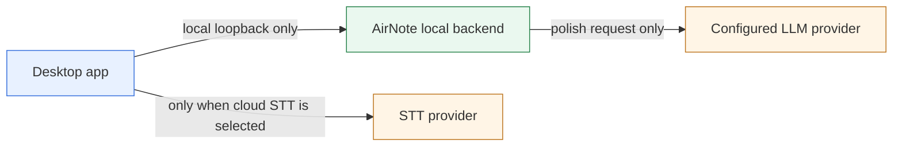
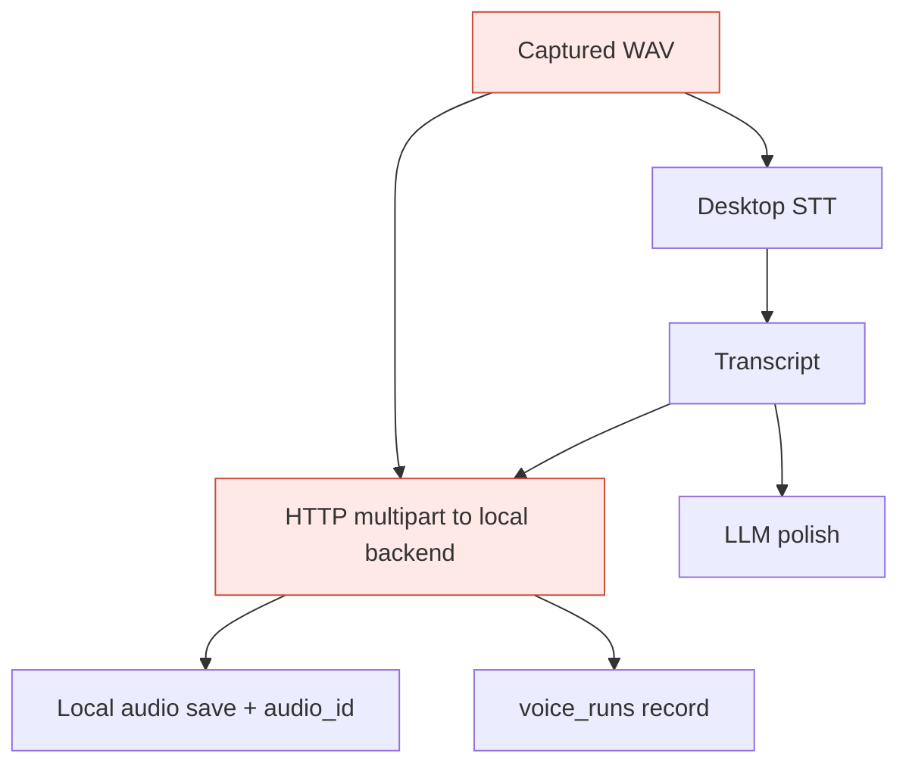
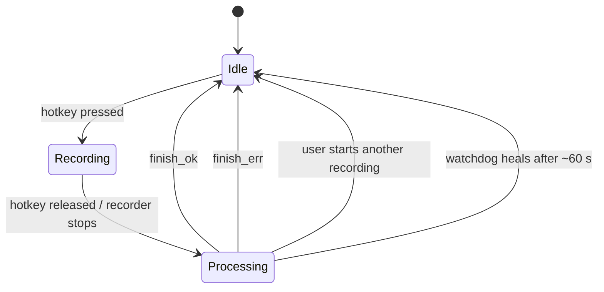

# Dictation Pipeline: Current State vs. Deterministic Target

**Status:** normal loopback dictation transport implemented locally. This document
records the retired HTTP/SSE path and the implemented target; final repository
verification and independent review remain required.

**Scope:** ordinary desktop dictation only. Meetings and their background services
are explicitly out of scope.

## Goal

Make the normal dictation path easy to reason about, privacy-conscious, and
recoverable:

1. The desktop owns speech-to-text (STT) routing.
2. The local backend owns one durable polish run at a time.
3. A local persistent WebSocket carries **text-polish** events, not microphone
   audio.
4. Every accepted run reaches exactly one terminal state: `completed`, `failed`,
   or, later, `cancelled`.
5. A disconnect never causes duplicate polish, duplicate paste, or an indefinitely
   stuck `Processing` state.

## Boundary map



The local backend is a sidecar process on the same machine. It is not the
deployed control plane. Therefore a persistent desktop-to-backend socket can
remove loopback connection churn and report sidecar restarts quickly, but it
cannot itself prevent an upstream STT or LLM provider outage.

---

## Retired normal-dictation pipeline

### End-to-end flow before this change

```mermaid
sequenceDiagram
  autonumber
  participant U as User
  participant D as Desktop / Tauri
  participant STT as Selected STT provider
  participant B as Local AirNote backend
  participant L as Polish LLM
  participant A as Focused app

  U->>D: Hold Caps Lock
  D->>D: Capture WAV; state = Recording
  U->>D: Release Caps Lock
  D->>D: Stop recorder; state = Processing
  D->>STT: WAV (local model or direct cloud request)
  STT-->>D: Transcript + metadata
  D->>B: Fresh HTTP multipart POST /v1/voice/polish\nWAV + transcript + metadata + context + run ID
  B->>B: Save WAV locally; create/mark voice run
  B->>L: Start streaming polish request
  L-->>B: Tokens / final result
  B-->>D: SSE status, token, done or error events
  D->>A: Type streamed tokens when supported
  D->>D: Reconcile final result; start edit watcher
  D->>D: finish_ok or finish_err; state = Idle
```

### Current STT credential and audio routing

| Selected route | Where the WAV goes | Where the key comes from today |
|---|---|---|
| On-device model | Stays on the desktop | No key |
| DeepInfra Whisper | Desktop directly to DeepInfra | Key baked into the desktop build, or desktop runtime env in development |
| GPT-4o mini Transcribe | Desktop directly to OpenAI | Key baked into the desktop build, or desktop runtime env in development |

There is **not** currently a user-BYOK-first, managed-server-fallback policy.
If an OpenAI key was not supplied to the desktop build or desktop process, the
OpenAI route fails; it does not silently call the deployed server.

### What was duplicated

Once STT already returned a transcript, the normal polish request sends the
same WAV again to the local backend. The backend does **not** need it to
polish the text. It currently uses it for local audio persistence, an
`audio_id`, retry/history support, and derived duration/byte metadata.



This is local-machine traffic, not a second upload to the deployed backend,
but it makes the normal run larger and mixes two responsibilities: polish
transport and audio retention/retry.

### Previous state and failure behavior



Important characteristics of the retired normal path:

- Each polish creates a fresh HTTP client/request and a fresh SSE stream.
- The request has one broad 120-second timeout, rather than separate connect,
  first-token, idle-stream, and total-run deadlines.
- The desktop does have generation guards, so a superseded run is prevented
  from typing or resetting the newer run.
- The state-heal watchdog eventually resets a stuck `Processing` state, but it
  is a safety net rather than a reliable run protocol.
- The backend process watchdog checks only while the app is idle. It cannot
  rescue an in-flight polish stream.
- Reusing the same `run_id` could reset a row through the HTTP conflict path,
  so it was not a safe resume protocol.

---

## Implemented normal-dictation pipeline

### Normal successful run

```mermaid
sequenceDiagram
  autonumber
  participant U as User
  participant D as Desktop run coordinator
  participant STT as Selected STT route
  participant W as Persistent local polish WS
  participant B as Local backend / run store
  participant L as Polish LLM
  participant A as Focused app

  Note over D,B: At app launch: authenticated WS connects and stays warm
  U->>D: Hold then release hotkey
  D->>D: Capture audio locally; create immutable run_id
  D->>STT: Transcribe WAV according to selected credential policy
  STT-->>D: Transcript + transcript metadata
  D->>W: polish.start(run_id, transcript, metadata, context)
  W->>B: Same message
  B->>B: Create run + register one in-memory producer
  B-->>D: run.accepted(run_id)
  B->>L: Stream polish request
  L-->>B: Tokens / result
  B-->>D: token(run_id, seq, text)
  D->>A: Render only unseen sequence numbers
  B->>B: Persist final terminal result
  B-->>D: done(run_id, final_text, final_seq)
  D->>D: Reconcile final text once; finish_ok; state = Idle
```

### Disconnect and resume

```mermaid
sequenceDiagram
  participant D as Desktop
  participant B as Local backend

  D->>B: polish.start(run-42, transcript)
  B->>B: Persist captured/processing state and start one producer
  B-->>D: run.accepted(run-42)
  B--xD: Socket breaks while LLM work continues
  D->>D: Enter Reconnecting; retain run_id and last_seq
  D->>B: reconnect + run.resume(run-42, last_seq)
  B-->>D: status/remaining events or final durable result
  D->>D: Deduplicate event sequence; terminate once
```

The desktop never sends `polish.start` again after it has observed acceptance
or progress. It resumes by `run_id`. If a reconnect explicitly returns
`unknown_run` before any acceptance/progress, it makes one same-ID start retry;
this covers a lost first frame without allowing blind replay after acceptance.

### State model

```mermaid
stateDiagram-v2
  [*] --> Idle
  Idle --> Recording: hotkey pressed
  Recording --> Transcribing: recording finalized
  Transcribing --> Connecting: local transcript ready; socket unavailable
  Transcribing --> Polishing: local transcript ready; socket ready
  Connecting --> Polishing: backend accepts or emits progress
  Connecting --> Failed: bounded reconnect deadline
  Polishing --> Reconnecting: socket lost after acceptance
  Reconnecting --> Polishing: resume/status succeeds
  Reconnecting --> Failed: bounded resume deadline
  Polishing --> Completed: durable done
  Polishing --> Failed: durable error or deadline
  Completed --> Idle
  Failed --> Idle
  Polishing --> Cancelled: future explicit cancel
  Cancelled --> Idle
```



The visible UI can still use friendly labels such as “Transcribing”,
“Polishing”, and “Reconnecting”. Internally, these named states make it
possible to tell whether a stall belongs to recorder shutdown, STT, local
transport, or remote LLM processing.

---

## Data and credential policy

### Polish transport payload

Normal polish sends text only:

```json
{
  "type": "polish.start",
  "protocol_version": 1,
  "run_id": "uuid",
  "transcript": "desktop-produced transcript",
  "pre_transcript_meta": { "model": "…", "duration_ms": 1234 },
  "target_app": "optional app identity",
  "screen_context": "bounded optional context",
  "message_polish_mode": false
}
```

No WAV belongs in this normal message.

### Audio retention and retry

Audio retention must be explicit and independent from polish:

| Need | Correct owner | Normal-path behavior |
|---|---|---|
| Crash recovery before STT completes | Desktop local recovery file | Keep locally and clear at terminal completion |
| Optional replay/retry audio | Existing desktop recovery/retry flow | Not part of normal WebSocket polish; no WAV is sent to the local backend |
| Voice-run audit | Local backend SQLite | Store run status and non-sensitive operational metadata; no audio required |
| Polish | Local backend | Transcript and bounded metadata only |

### Future STT credential policy

| Mode | Audio path | Key ownership |
|---|---|---|
| Local STT | Device only | None |
| User BYOK | Desktop → chosen STT provider | User key in OS keychain; never telemetry or logs |
| AirNote managed STT | Desktop → dedicated AirNote STT gateway → provider | Server secret; never bundled in the desktop app |

This policy must be resolved before a recording is sent. There must be no
hidden fallback from a user-selected local/BYOK route to a managed route.

---

## Implemented protocol invariants

| Invariant | Why it matters |
|---|---|
| `run_id` is generated once and immutable | Identifies the user action across reconnects |
| One in-memory producer per `run_id` | Duplicate socket starts subscribe to the active work rather than launch another model request |
| Every outbound event has `run_id` and monotonic `seq` | Client can ignore duplicated stream events and reconcile to the final result |
| Terminal result is persisted before `done` | Resume works even if the socket closes just before delivery |
| Exactly one client terminal transition | No permanent Processing and no late event can reset a newer dictation |
| Desktop treats reconnect as resume, never blind replay | No duplicate LLM work or paste |
| Bounded desktop reconnect/idle (30 s)/total (120 s), plus producer first-event (20 s)/idle (30 s)/total (120 s) deadlines | A healthy socket cannot hide a broken connection or indefinitely stuck run |
| Backpressure is bounded | The local process cannot accumulate unlimited tokens/messages |

## Failure matrix

| Failure point | Desktop action | Backend action | User result |
|---|---|---|---|
| Local recorder cannot finish | Terminal error | None | Recording error; Idle |
| STT fails | Terminal error | None | Actionable STT error; Idle |
| Socket unavailable before acceptance | Reconnect within a bounded deadline; one same-ID re-start only if backend says `unknown_run` | None | “Reconnecting”; then terminal error if unavailable |
| Socket drops after acceptance | Resume by run ID and last sequence | Continue or return durable status | No duplicate run/paste |
| Local backend restarts | Reconnect, then status/resume | Durable run store answers request | Final result or retryable terminal error |
| Remote LLM stalls | Hit first-event/idle/total deadline | Producer records and broadcasts a durable terminal failure | Terminal outcome; never endless Processing |
| Duplicate event | Ignore by `(run_id, seq)` | May resend safely | No duplicate text |
| New dictation starts | Supersede old generation | Old run may finish, but cannot deliver/paste | New recording stays authoritative |
| Future user cancel | Send idempotent cancel | Stop LLM task; persist `cancelled` | No later paste |

---

## Follow-up work (not implemented in this transport change)

### Phase 1 — make the current semantics explicit

1. Extract a desktop `DictationRunCoordinator` that owns state transitions,
   deadlines, terminalization, and generation checks.
2. Define backend `VoiceRun` states and valid transitions; replace conflict
   reset behavior with atomic create-or-get plus a lease.
3. Persist completed/failed outcomes before delivery and add a status/result
   lookup by `run_id`.
4. Add structured timings for recorder-stop, STT, local-connect, accept,
   first-token, idle, LLM-total, and terminal delivery.

### Phase 2 — separate audio from normal polish

1. Create one canonical text-polish request type shared by HTTP and WebSocket.
2. Make the normal local-transcript route text-only.
3. Move optional audio persistence/retry behind a separate explicit service.
4. Update voice-run metadata to accept duration and byte facts from the desktop
   without requiring an uploaded WAV.

### Phase 3 — introduce the persistent local WebSocket

1. Add a new authenticated local endpoint, separate from
   `/v1/runtime/live/ws`.
2. Add a desktop connection manager: startup connect, heartbeat, bounded
   exponential reconnect, and health reporting.
3. Implement `polish.start`, `run.accepted`, `status`, `token`, `done`,
   `error`, `ping`, `pong`, and the reserved `cancel` message shape.
4. Keep HTTP/SSE as a protocol-compatible fallback during the first rollout.

### Phase 4 — prove the failure behavior

Test at minimum:

- local backend killed before acceptance, after acceptance, after a token, and
  after durable completion but before `done`;
- socket black-hole (open but silent);
- remote LLM first-token timeout and idle-stream timeout;
- duplicate same-ID/same-hash and same-ID/different-hash submissions;
- out-of-order and duplicate token events;
- a new dictation while an old run reconnects;
- app shutdown/relaunch with a durable in-flight run.

## Definition of done

The cleanup is complete only when:

- normal polish carries no WAV after a desktop transcript exists;
- STT route and key ownership are explicit before audio leaves the device;
- a user can always begin a new recording after a bounded failure window;
- reconnecting cannot cause a duplicate model run or duplicate paste;
- a completed run can be recovered by run ID after a sidecar restart;
- every terminal result has one persisted state, one user-visible outcome, and
  one cleanup path;
- meetings remain behaviorally unchanged.

## Code map for the current implementation

| Concern | Current location |
|---|---|
| Desktop state machine | `desktop/src-tauri/src/desktop.rs` |
| Dictation STT routing and desktop-held cloud keys | `desktop/src-tauri/src/dictation_stt.rs` |
| Device policy | `desktop/src-tauri/src/stt_policy.rs` |
| Current HTTP/SSE transport | `desktop/src-tauri/src/api.rs` |
| Dictation orchestration, generation guard, paste/reconcile, watchdog | `desktop/src-tauri/src/main.rs` |
| Backend voice route and SSE producer | `crates/backend/src/routes/voice.rs` |
| Voice-run persistence | `crates/backend/src/store/voice_runs.rs` |
| Existing unrelated live-runtime WebSocket | `crates/backend/src/routes/runtime_live.rs` |

The existing live-runtime WebSocket must not be reused for this work. It is a
cloud-audio proxy with different data ownership and completion semantics.
