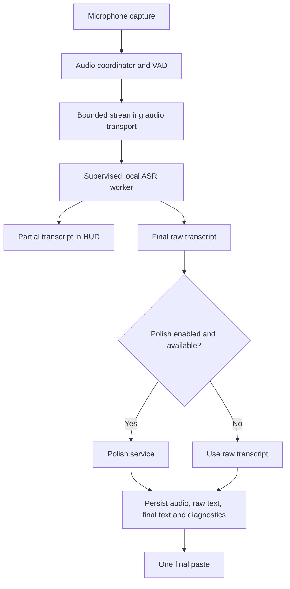

# AirNote local model runtime modernization plan

Status: implementation in progress  
Last updated: 2026-07-31  
Reference implementation studied: Handy (`cjpais/handy`, commit `099df58a591bb8ab07ee16dc8e4e8d69d1270791`)

## Purpose

Build a production-quality local speech-to-text platform for AirNote that is as dependable and understandable as Handy while remaining native to AirNote's architecture.

The first new model is Parakeet Unified EN 0.6B, but the design must support future small, medium, and large models without adding another provider-specific branch for every model. The work must preserve AirNote's cloud routing, one-shot paste, history, audio retention, learning pipeline, meeting models, and existing local model users.

This is not a plan to copy Handy wholesale. Handy is the behavioral and failure-handling reference. AirNote will retain its stronger pieces, especially isolated GPU workers, pooled SQLite storage, durable voice runs, final-only paste, and correction metadata.

## Product outcome

A user can install an eligible local model, record normally, see optional live transcription in the AirNote HUD, and receive one final paste. The dictation succeeds without internet when polish is disabled. Model downloads survive interruption, native inference failures do not crash the desktop app, failed audio remains retryable, and the UI always explains what model and compute backend were actually used.



Streaming refers to local recognition and HUD updates. Partial tokens must never be typed into the focused application.

## Non-negotiable architecture principles

1. **One catalog, many models.** Model identity, artifacts, capabilities, requirements, licensing, and download integrity live in one descriptor system.
2. **Model data does not select application behavior.** Catalog descriptors declare facts; policy decides what is recommended; runtime reports what is actually available.
3. **Generic runtime interfaces.** Parakeet, Nemotron, Whisper, and future engines plug into a common lifecycle. UI and dictation orchestration must not switch on filenames or provider names.
4. **Native inference is supervised.** A model or GPU driver crash must not take down the Tauri process.
5. **Streaming is bounded and cancellable.** No unbounded PCM queues, late finalization, or stale recording that pastes after cancellation.
6. **Final-only paste remains sacred.** Streaming improves feedback and latency but does not reintroduce streaming paste.
7. **Local STT success is sufficient.** Disabled, unavailable, or failed polish must not turn a valid local transcript into a failed dictation.
8. **History is independent of polish.** Audio, raw transcript, final output, model identity, runtime metadata, and failure state remain persistable in every route.
9. **Capabilities are verified.** Catalog claims are checked against the artifact and loaded runtime where possible. Unknown is represented as unknown, not guessed.
10. **Safe migration and rollback.** Existing preferences and installed artifacts remain usable; a failed new model load preserves a working route.
11. **No model-size assumptions in orchestration.** Small, medium, and large models share interfaces while policy controls eligibility, preload, concurrency, and eviction.
12. **No unrelated regression.** Meeting transcription, cloud STT, polish, learning, history retention, paste behavior, and control-plane settings remain isolated behind stable boundaries.

## What Handy does better today

### Catalog and discovery

- Bundles a structured offline catalog.
- Pins immutable model revisions.
- Records language, architecture, quantization, size, SHA-256, and runtime capabilities.
- Separates static catalog data from installed and loaded state.
- Probes GGUF metadata and reconciles capabilities after load.

### Installation

- Resumes partial downloads with HTTP Range.
- Detects invalid Range responses and unexpected file growth.
- Uses connection and no-progress timeouts.
- Supports cancellation without throwing away valid progress.
- Shows downloading, verifying, extracting, and failed phases separately.
- Activates a model only after size and hash verification.
- Recovers from a crash between download completion and final rename.

### Runtime lifecycle

- Coordinates single-flight loading and model switching.
- Drops the previous engine before loading a replacement to avoid double peak memory.
- Does not keep the manager lock held throughout native inference.
- Supports idle unloading without unloading during an active recording.
- Reports load, unload, and error events consistently.
- Clears invalid engine state after a caught panic.

### Audio and streaming

- Starts model and VAD preparation with recording.
- Uses fixed-frame VAD, pre-roll, onset confirmation, and speech hangover.
- Resets VAD state between recordings.
- Drains capture and resampler state on stop so the final audio is not clipped.
- Supports streaming recognition with a bounded finalization period and batch fallback.

### Recovery and UX

- Keeps failed audio retryable.
- Records raw and post-processed output separately.
- Exposes clear model lifecycle states and actionable diagnostics.
- Supports retrying stored audio with the currently selected model.

## What AirNote already does well

- One final HID paste instead of typing partial tokens.
- Existing warm local inference and model reuse.
- Windows GPU inference isolation with timeout, crash detection, CPU fallback, and quarantine.
- Exact size and SHA verification for the Nemotron downloader.
- Local history with audio, raw STT, model, timing, and final text metadata.
- Durable voice-run storage and backend retry infrastructure.
- Crash-recovery PCM for an interrupted dictation.
- A central STT policy used by onboarding, settings, and the hot path.
- Pooled SQLite and explicit 24-hour audio retention.

These should be generalized or connected, not replaced by weaker equivalents from Handy.

## Current AirNote gaps

1. Catalog metadata is duplicated across `nemotron.rs`, `local_models.rs`, `stt_policy.rs`, TypeScript types, and UI command branching.
2. Runtime ownership is divided into Nemotron-, Whisper-, meeting-, and platform-specific implementations rather than one model lifecycle.
3. Download cancellation, resumption, timeout, and integrity behavior differs by model.
4. Local dictation is primarily batch inference after key release; current audio streaming is not live local ASR.
5. Normal dictation lacks one consistent VAD, pre-roll, stop-drain, and streaming-finalization policy.
6. In-process native models can still terminate the desktop app through a native abort or segmentation fault.
7. Policy mostly uses platform, architecture, and total RAM rather than a reusable capability/admission result.
8. Installed checks are not equally strict for every model.
9. Local-STT failures do not receive the same durable, user-visible retry experience as backend failures.
10. Settings do not expose the actual backend, loaded state, fallback reason, or recent local inference performance.
11. Skipping polish does not yet have an explicit end-to-end completion and persistence contract.
12. Model-specific names and commands will become unmaintainable as small, medium, and large models are added.

## Target module boundaries

Names are provisional. The important decision is ownership and dependency direction.

### `catalog`

Owns immutable model descriptors and their validation.

```text
LocalModelDescriptor
  id
  display_name
  family / architecture
  languages
  artifacts[]
  runtime_kind
  capabilities
  license / attribution
  resource_requirements
```

It must not know about React, selected preferences, recording state, or download progress.

### `model_store`

Owns artifact installation:

- Resolve catalog artifact.
- Check disk space.
- Resume, cancel, retry, and verify.
- Atomically activate or safely remove files.
- Report a stable installation state machine.
- Reconcile existing AirNote artifacts during migration.

It must not load inference engines.

### `local_asr_runtime`

Owns the common interface for an installed model:

- Probe capabilities.
- Load and unload.
- Open batch or streaming session.
- Consume audio.
- Finalize or cancel.
- Return partial/final transcript and measured diagnostics.

Individual adapters can use transcribe.cpp, whisper.cpp, ONNX, or future runtimes without leaking those types to dictation orchestration.

### `local_asr_supervisor`

Owns worker processes and resilience:

- Worker start and handshake timeout.
- Request timeout and cancellation.
- Crash/EOF detection and restart.
- CPU fallback and backend quarantine.
- Exactly one active model lease where required.
- Drop-before-switch and idle eviction.
- Actual backend/device reporting.

### `dictation_session`

Owns one recording lifecycle:

- Recording generation/token.
- Audio capture, pre-roll, VAD, and stop drain.
- Streaming HUD partials.
- Batch fallback from the complete audio.
- Optional polish decision.
- Persistence and exactly one final paste.

It depends on interfaces, not concrete model families.

### `stt_policy`

Owns eligibility and recommendation only:

- OS and architecture.
- CPU instruction support.
- Available memory and disk.
- Available acceleration backends.
- Language compatibility.
- User selection and enterprise constraints.
- Small/medium/large model recommendation.

Policy must never claim that a backend loaded successfully; the runtime supplies that fact.

## Planned repository paths

The exact file split will be confirmed before implementation. Expected areas are:

| Area | Existing paths affected |
|---|---|
| Catalog and inventory | `desktop/src-tauri/src/local_models.rs`, `desktop/src-tauri/src/nemotron.rs`, new focused catalog modules |
| Installation | `desktop/src-tauri/src/nemotron.rs`, relevant download code in `meeting_engine.rs`, Tauri model commands |
| Runtime and supervision | `desktop/src-tauri/src/dictation_stt.rs`, `desktop/src-tauri/src/asr/`, `crates/asr-core/` |
| Streaming session | `desktop/src-tauri/src/whisper_dictation_stream.rs`, recording coordination in `desktop/src-tauri/src/main.rs` |
| Device policy | `desktop/src-tauri/src/stt_policy.rs` and its tests |
| Preferences | `crates/core/src/prefs.rs`, desktop preference commands, backend preference storage where persistence requires it |
| Completion/history | `crates/backend/src/routes/voice.rs`, `crates/backend/src/store/history.rs`, `crates/backend/src/store/voice_runs.rs` |
| Settings and HUD | `desktop/src/components/DictationSttSection.tsx`, `desktop/src/StatusBar.tsx`, shared invoke/event types |
| Packaging | Tauri sidecar configuration and DMG/Windows build scripts if a generic worker is introduced |
| Tests | Existing Rust unit/integration tests, desktop typecheck, targeted runtime and failure-injection tests |

Control-plane changes are only required if polish enablement or model policy is deliberately synchronized across devices. Device-local model files, worker state, and runtime diagnostics must remain desktop-owned.

## Initial catalog model: Parakeet Unified EN 0.6B

Initial intent:

- Model: `nvidia/parakeet-unified-en-0.6b`
- Conversion: pinned GGUF artifact compatible with the selected runtime
- Language: English only
- Initial quantization: Q8 unless device testing establishes a better default
- Approximate artifact size: 731 MB for Q8; Q4 remains a possible lower-resource option
- Mode: offline batch is mandatory
- Streaming: enabled only after the exact conversion/runtime combination passes capability and correctness tests
- Translation and multilingual routing: unsupported

Release blockers:

- Pin the exact repository revision and artifact hash.
- Verify the artifact source and runtime compatibility.
- Resolve upstream versus conversion license/attribution metadata and ship the required notice.
- Benchmark cold load, warm inference, peak memory, realtime factor, and transcript quality on the supported hardware matrix.
- Never silently select it for Hindi, Hinglish, or automatic multilingual input.

## Work plan

### Phase 0 — Freeze contracts and measurements

- [ ] Record current cloud and local dictation behaviour as regression tests.
- [ ] Define catalog, installation-state, runtime-status, and transcript-result types.
- [ ] Define exactly-once final paste and cancellation-generation invariants.
- [ ] Define raw/final/history semantics when polish is disabled or unavailable.
- [ ] Establish baseline load time, inference time, memory, and failure behaviour.
- [ ] Confirm the Parakeet artifact, revision, checksum, license, and runtime capabilities.

Exit condition: interfaces and acceptance tests make the intended boundaries unambiguous.

### Phase 1 — Catalog and resilient model store

- [x] Add a bundled, validated catalog for Parakeet and Nemotron dictation models.
- [x] Preserve legacy model IDs/preferences through explicit migration aliases.
- [x] Replace filename/provider branching in UI commands with descriptor-driven commands.
- [x] Implement resumable partial downloads and Range validation.
- [x] Add cancellation, connection timeout, stall timeout, bounded retry, exact length, and SHA verification.
- [x] Separate downloading, verifying, available, retrying, cancelled, and failed events.
- [x] Recover complete partial files after restart and atomically activate them.
- [x] Unify catalog installed-state validation and cleanup rules without weakening meeting-model protection.

Exit condition: interrupted, cancelled, corrupted, oversized, and restarted downloads behave predictably for every catalog artifact.

### Phase 2 — Generic supervised local runtime

- [x] Introduce a generic catalog-backed transcribe.cpp runtime without exposing engine types to dictation orchestration.
- [x] Move Nemotron/transcribe.cpp behaviour behind the generic runtime and retain compatibility commands.
- [x] Add Parakeet through the same runtime.
- [ ] Generalize the existing worker protocol or introduce a compatible local-ASR worker protocol.
- [ ] Enforce start/request/finalize timeouts, cancellation, restart, and crash detection.
- [ ] Add CPU fallback and per-session backend quarantine.
- [x] Drop the old model before loading a replacement.
- [x] Add idle eviction while keeping an active stream leased.
- [x] Report actual model, backend, architecture, load state, streaming support, errors, and load time.

Exit condition: a corrupt model, native crash, hung inference call, unavailable GPU, or model switch cannot crash the desktop app or produce a stale paste.

### Phase 3 — Streaming transcription and audio correctness

- [x] Bind stream feed, drain, finalization, HUD partials, and paste suppression to the recording ID/generation.
- [ ] Start model/VAD preparation as recording begins.
- [ ] Add fixed-frame VAD with reset, pre-roll, onset confirmation, and hangover.
- [x] Use bounded frame transport with complete-audio batch fallback on overflow.
- [x] Stream partial transcripts to the HUD only.
- [x] Drain the final capture callback before stream finalization.
- [x] Treat live streaming as HUD preview only, release its model lease on stop, then use the complete saved audio for the authoritative batch transcript; fail honestly if the lease cannot be released.
- [x] Prevent an older or cancelled recording from updating the HUD, persistence, or paste path.
- [x] Preserve exactly one final paste.

Exit condition: first/last words are not clipped, slow inference cannot grow memory without bound, and streaming failure still yields a correct batch result.

### Phase 4 — Optional polish and offline-safe completion

- [x] Add an independent `polish_enabled` preference; do not repurpose message-polish mode.
- [x] When disabled, make the local raw transcript the final output.
- [ ] Define fallback-to-raw behaviour for offline, timeout, and polish failure cases.
- [x] Persist audio, raw text, final text, model, and timings before reporting a successful unpolished result.
- [x] Preserve the existing 24-hour audio retention path.
- [x] Keep correction learning compatible with distinct raw and final fields.
- [x] Ensure cloud STT and polished dictation continue to use their existing routes.

Exit condition: AirNote can complete, persist, and paste a local dictation without any network request.

### Phase 5 — Recovery, Settings, and HUD

- [ ] Make pre-STT failures durable and retryable from History.
- [ ] Allow retry with the same or a newly selected compatible model.
- [x] Expose install, download, verification, load, active, and error states to normal users.
- [ ] Add expandable diagnostics for model revision/hash, actual backend/device, load/inference timing, fallback reason, and worker failures.
- [x] Show English-only and streaming/batch capability constraints before selection.
- [x] Show local model download size and reject installation when disk space is insufficient.
- [ ] Preserve the previous working provider if a new selection cannot load.

Exit condition: a user can understand and recover from model installation, loading, inference, and polish failures without reading logs.

### Phase 6 — Capability policy and future model sizes

- [ ] Replace broad platform locks with a reusable capability/admission result.
- [ ] Model requirements for small, medium, and large tiers.
- [ ] Consider available RAM, free disk, CPU instructions, backend support, GPU/VRAM, language, and measured performance.
- [ ] Keep explicit user selection separate from recommendations.
- [ ] Add a local preflight/test command.
- [ ] Add automatic network-quality routing only after manual local mode is stable.
- [ ] Keep recommendation rules data-driven and testable rather than scattered across UI conditions.

Exit condition: adding another model requires a descriptor and runtime adapter, not edits throughout dictation, onboarding, Settings, and History.

### Phase 7 — Qualification and rollout

- [ ] Test Apple Silicon 8 GB and 16+ GB devices.
- [ ] Test supported Intel macOS CPUs if local mode is enabled there.
- [ ] Test AVX2 Windows CPU and NVIDIA/AMD/Intel acceleration paths.
- [ ] Test Windows ARM emulation guards where relevant.
- [ ] Exercise offline, poor network, cancellation, app restart, corrupt artifact, low disk, low memory, worker crash, GPU failure, and model-switch scenarios.
- [ ] Benchmark cold/warm latency, realtime factor, peak RSS/VRAM, and transcription quality.
- [ ] Compare Parakeet against the selected cloud baseline using retained test audio.
- [ ] Roll out behind a reversible preference/feature gate before changing recommendations.
- [ ] Preserve previous runtime and preference migration rollback until qualification completes.

Exit condition: supported combinations have measured performance, reliable degradation, and a documented rollback.

## Acceptance criteria

### Installation

- A killed or disconnected download resumes from valid partial data.
- Invalid size or SHA never becomes an installed model.
- Cancelling does not leave the UI or runtime in a loading state.
- Restarting after a completed-but-unrenamed download recovers without downloading again.

### Runtime

- Only one large model is resident unless an adapter explicitly supports safe coexistence.
- Switching models does not create double peak memory.
- Native worker failure cannot terminate AirNote.
- A failed GPU path can finish the current dictation on CPU when supported.
- Idle unloading never occurs during active recording or inference.

### Streaming and paste

- Partial text appears only in the HUD.
- Releasing or cancelling drains/stops the correct recording generation.
- Streaming failure falls back to complete-audio batch transcription.
- Exactly one final paste occurs.

### Offline and polish

- Local STT plus disabled polish makes no network request.
- A valid raw transcript remains usable if optional polish is unavailable.
- Raw/final text and the polish decision are retained correctly.
- History and 24-hour audio retention work with polish both on and off.

### Modularity

- UI does not branch on model filenames.
- Policy does not load models or perform downloads.
- Catalog does not contain mutable runtime state.
- Runtime adapters do not own history, paste, or preference policy.
- Adding a model does not require changes across every application layer.

### Non-regression

- Cloud dictation remains operational.
- Existing local users retain compatible selections and artifacts.
- Meeting transcription and protected meeting models are unaffected.
- Learning cache invalidation and correction persistence remain intact.
- macOS and Windows paste timing remains unchanged.

## Testing strategy

1. Catalog schema and duplicate-ID tests.
2. Artifact revision, expected size, and SHA fixtures.
3. Download server tests for Range, ignored Range, 416, stalls, cancellation, restart, oversized response, and checksum mismatch.
4. Runtime state-machine tests for concurrent load, switch, unload, crash, timeout, and stale response.
5. Streaming tests for bounded queues, cancellation generations, finalization timeout, and batch fallback.
6. Audio fixtures for first-word/last-word clipping and VAD reset.
7. End-to-end tests for polish on, polish off, offline fallback, history persistence, retry, and exactly-one paste.
8. Hardware qualification runs with recorded load, memory, backend, and realtime metrics.
9. Existing `just check` plus targeted desktop, backend, and worker tests before each phase is committed.

## Observability and privacy

Local diagnostics may record:

- Model ID, revision, and hash prefix.
- Requested and actual backend/device.
- Load, queue, inference, polish, and total timings.
- Audio duration and realtime factor.
- Fallback reason, timeout category, and worker exit count.
- Process memory and VRAM where reliably available.

Diagnostics must not transmit audio or transcript content. Remote telemetry remains opt-in and aggregate. Local History continues to follow the configured retention policy.

## Migration and rollback

- Map existing preference values to stable catalog IDs.
- Detect and adopt existing verified model files rather than redownloading them.
- Keep old routes available behind a temporary rollback gate during qualification.
- Do not delete legacy artifacts automatically during migration.
- If a new model cannot install or load, preserve the last working selection.
- Keep catalog/runtime protocol versions explicit so desktop and worker incompatibility fails cleanly.

## Explicitly rejected shortcuts

- Adding Parakeet as another `NemotronVariant`.
- Hardcoding model files in React.
- Treating file size alone as installation integrity.
- Running a new GPU backend in-process without crash containment.
- Advertising streaming because a catalog flag says it exists.
- Skipping history when polish is disabled.
- Automatically routing Hinglish to an English-only model.
- Reintroducing partial or token-by-token paste.
- Building one abstraction that combines catalog, download, runtime, policy, persistence, and UI state.
- Copying Handy's full multi-engine surface without an AirNote requirement.

## Decisions still to close

- Resolve the required notice for the pinned Parakeet conversion against the current upstream NVIDIA license metadata.
- Parakeet starts Q8-only; add Q4 only if hardware qualification shows a concrete need.
- Whether the generic worker is a generalized `airnote-asr-gpu` protocol or a new `airnote-local-asr` sidecar.
- Which platforms receive Parakeet in the first qualification wave.
- Default idle-unload duration by model size/device memory.
- Whether polish failure automatically falls back to raw text or requires an explicit preference separate from `polish_enabled`.
- The pinned Parakeet GGUF is deliberately batch-only; identify and qualify a different artifact/runtime before advertising Parakeet streaming.

## Progress log

- [x] Cloned and inspected Handy read-only.
- [x] Compared Handy's catalog, downloader, runtime lifecycle, acceleration, audio/VAD, streaming, history, and UX with AirNote.
- [x] Completed an independent AirNote gap analysis and an adversarial cross-platform review.
- [x] Agreed that Handy is the behavioural reference while AirNote keeps its stronger isolation and persistence patterns.
- [x] User confirmed the plan and authorized implementation.
- [x] Began implementation with the catalog/store/runtime and optional-polish vertical slice.
- [x] Added Parakeet Unified EN 0.6B Q8 as an English-only, batch-capable catalog model.
- [x] Added targeted tests for catalog integrity, policy admission, inventory, preference compatibility, and unpolished history/audio persistence.
